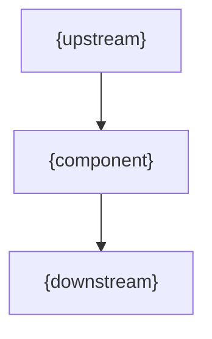

# RFC-XXXX — {Title}

**Status:** Draft
**Author:** {author}
**Version:** 1.0

---

# 1. Purpose

{One paragraph: what this RFC defines.}

---

# 2. Motivation

{Why needed? What breaks without it?}

---

# 3. Philosophy

{Component} must be:

* {Property}

---

# 4. Responsibilities

{Component} must:

* …

{Component} must never:

* …

---

# 5. Data Flow



---

# 6. Contract

```text
{operation}(input) -> {:ok, result} | {:error, reason}
```

---

# 7. {Domain Section}

…

---

# 8. Out of Scope

This RFC does not define:

* … (RFC-XXXX);

---

# 9. Decisions

## DEC-001

{Decision statement}
